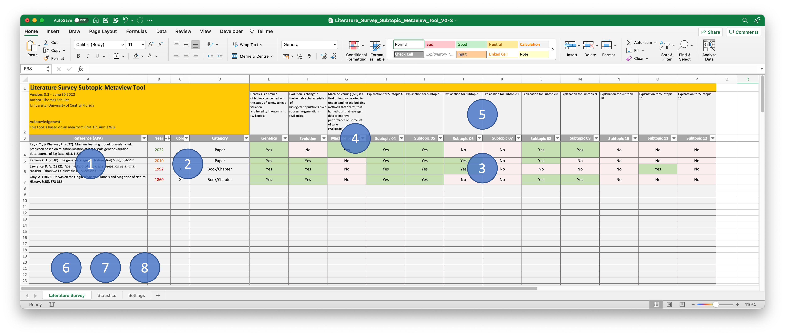

# Literature Survey Subtopic Metaview Tool

This is a simple tool to get an overview on subtopics in a literature survey for a thesis, paper or any other academic work.
It is created in Microsoft Excel 365 and should work properly in the offline application.

Please use and change this tool however you like and however it serves you.

1. Type in your reference in APA or any other style your like.
2. Type in year of publication (color changes depending on age). 
	Set if core paper. And set category (dropdown). 
3. Define if subtopic is addressed in reference.
4. Place for small explanation of subtopic.
5. Define subtopics in gray cells here.
6. Sheet of the literature review.
7. Sheet for statistics (automatically created). Need to be sorted manually.
8. Sheet for settings: Colored age categories as well as reference categories can be defined.

## Acknowledgment:
The idea of this literature review tool is based on an idea of Prof. Dr. Annie Wu.